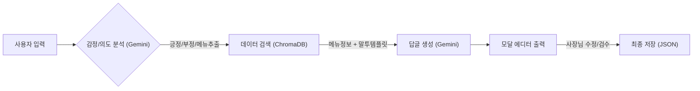

# 💬 AI ReplyMate (AI 리플메이트)

> **소상공인을 위한 리뷰 답글 자동 생성 AI 솔루션**
> "바쁜 사장님을 대신해, AI가 상황과 메뉴를 이해하고 센스 있는 답글을 달아드립니다."


## 📖 프로젝트 개요 (Overview)

**AI ReplyMate**는 배달 앱등 소상공인들이 리뷰 관리에 들이는 시간과 감정 소모를 줄여주기 위해 개발된 AI 서비스입니다. 

단순히 텍스트를 생성하는 것이 아니라, **KoBERT**를 이용한 정밀한 감정 분석과 **RAG(검색 증강 생성)** 기술을 활용하여, 가게의 **메뉴 정보**와 사장님의 **평소 말투(Tone & Manner)** 를 반영한 **'진정성 있는 답글'** 을 생성합니다.

### 🎯 기획 배경 (Why?)
- **⏳ 시간 부족:** 1인 가게나 소규모 매장은 조리와 배달 준비로 인해 CS(리뷰 관리)에 할애할 시간이 부족합니다.
- **🤯 감정 노동:** 악성 리뷰나 불만 리뷰에 일일이 대응하다 보면 심한 스트레스를 받게 됩니다.
- **📉 획일화된 답변:** "감사합니다. 또 이용해주세요."와 같은 복사-붙여넣기 식 답변은 고객 만족도를 떨어뜨립니다.

---

## ✨ 주요 기능 (Key Features)

1. **하이브리드 감정 분석 & 키워드 추출**
   - **KoBERT** 모델로 긍정/부정을 판단하고, **LLM**이 리뷰 속 핵심 메뉴와 불만 요소를 추출합니다.
   
2. **카드형 리뷰 관리 UI**
   - 직관적인 카드 형태의 UI에서 리뷰를 관리하고, 답글 생성 후 **[완료]** 버튼을 눌러 데이터를 저장/관리할 수 있습니다.

3. **맥락 기반 메뉴 매칭 (Context-Awareness)**
   - "치즈돈까스가 식었어요"라는 리뷰에 대해, 등록된 메뉴 정보(조리법, 특징)를 RAG로 검색하여 전문적인 답변을 생성합니다.

4. **사장님 말투 학습 (Few-shot Learning)**
   - 기본 톤(정중/친근/유머) 외에 **[사장님 말투]** 모드를 제공합니다. 사장님이 평소 쓰는 댓글을 입력하면 AI가 그 스타일을 즉시 학습하여 모방합니다.

5. **실시간 데이터 대시보드**
   - 저장된 리뷰 데이터를 바탕으로 **긍정/부정 비율**, **주요 키워드 워드클라우드(WordCloud)** 등을 시각화하여 보여줍니다.

6. **엑셀 스타일 메뉴 관리**
   - 복잡한 설정 없이 엑셀처럼 표에서 메뉴 정보를 추가, 수정, 삭제하고 AI에게 실시간으로 반영할 수 있습니다.

---

## 🛠 기술 스택 (Tech Stack)

| 구분 | 기술 / 도구                   | 설명 |
| :--- |:--------------------------| :--- |
| **Frontend** | `Streamlit`               | 웹 인터페이스 및 대시보드 (Custom CSS 적용) |
| **Framework** | `LangChain`, `LangGraph`  | LLM 워크플로우 제어 및 프롬프트 관리 |
| **AI Model** | `KoBERT`                  | 한국어 리뷰 감정 분류 (Hugging Face) |
| **LLM** | `Google Gemini 2.5 Flash` | 고속 답글 생성 및 데이터 분석 |
| **Vector DB** | `ChromaDB`                | 답변 템플릿 및 메뉴 정보 로컬 저장 (Metadata Filtering) |
| **Environment** | `Python 3.10+`            | 개발 언어 |

---

## 🏗 시스템 아키텍처 (Workflow)



## 🚀 설치 및 실행 방법 (Getting Started)
이 프로젝트는 로컬 환경에서 실행할 수 있도록 설계되었습니다.

1. 레포지토리 클론 (Clone)
```bash
git clone https://github.com/JungwooJoon/ai-replymate.git
cd ai-replymate
```
2. 가상환경 설정 (Virtual Environment)
```Bash
# Windows
python -m venv venv
.\venv\Scripts\activate

# Mac/Linux
python3 -m venv venv
source venv/bin/activate
```
3. 패키지 설치 (Install Dependencies)
```Bash
pip install -r requirements.txt
```
4. API 키 설정 (보안)
본 프로젝트는 보안을 위해 API Key를 코드에 포함하지 않습니다. `.env.example` 파일을 활용하여 환경 변수를 설정해주세요.

   1. **키 발급:** [Google AI Studio](https://aistudio.google.com/)에서 무료 API Key를 발급받습니다.
   2. **환경 변수 파일 생성:**
       * 프로젝트 루트에 있는 `.env.example` 파일의 이름을 `.env`로 변경합니다. (또는 복사해서 `.env` 생성)
       * `.env` 파일은 `.gitignore`에 등록되어 있어 GitHub에 업로드되지 않습니다.
   3. **키 입력:** 생성된 `.env` 파일을 열고 발급받은 키를 입력합니다.

    **`.env` 파일 예시:**
    ```env
    GOOGLE_API_KEY=AIzaSyD-여기에-당신의-API키를-입력하세요
    ```
5. 애플리케이션 실행 (Run)
```Bash
streamlit run app.py
```
실행 후 브라우저에서 http://localhost:8501로 접속합니다.

## 📂 폴더 구조 (Directory Structure)
```
ai-replymate/
├── app.py                 # [Main] 앱 실행 진입점
├── requirements.txt       # 의존성 패키지 목록
├── data/                  # [Data] 데이터 저장소 (JSON)
│   ├── templates.json     # 학습된 말투 데이터
│   ├── menu_info.json     # 메뉴 정보
│   ├── saved_reviews.json # 완료된 리뷰 기록
│   ├── store_info.json    # [Config] 가게 이름 설정 값
│   └── draft_reviews.json # [Cache] 작성 중 임시 저장 (복구용)
├── src/
    ├── workflow.py        # [AI] LangGraph 파이프라인 (분석->검색->생성)
    ├── rag.py             # [AI] ChromaDB 검색 로직
    ├── models.py          # [AI] Gemini 모델 로더 (캐싱 적용)
    ├── data_manager.py    # [Util] 데이터 I/O 및 전처리
    └── ui/                # [UI] 화면 구성 요소 (모듈 분리됨)
        ├── styles.py      # Custom CSS 디자인
        ├── sidebar.py     # 사이드바 설정
        ├── cards.py       # 리뷰 관리 컨트롤러
        ├── card_views.py  # 리뷰 리스트/카드/모달 뷰 렌더링
        ├── dashboard.py   # 대시보드 통계
        ├── menu.py        # 메뉴 관리 탭
        └── training.py    # 말투 학습 탭
```
